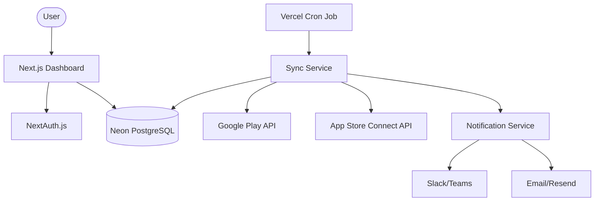

# Mobile App Monitoring System Implementation Plan

This plan outlines the design of a centralized dashboard to track the status of mobile applications on Google Play and Apple App Store.

## Proposed Architecture

### Tech Stack
- **Frontend/Backend**: [Next.js](https://nextjs.org/) (React, App Router) deployed on [Vercel](https://vercel.com/).
- **Database**: PostgreSQL hosted on [Neon](https://neon.tech/).
- **ORM**: [Prisma](https://www.prisma.io/) or [Drizzle ORM](https://orm.drizzle.team/).
- **Auth**: [NextAuth.js](https://next-auth.js.org/) for secure dashboard access.
- **Sync Worker**: Vercel Cron Jobs for periodic API polling.
- **Notifications**: Resend for Email, Webhooks for Slack/Teams.

### System Diagram


## Database Schema (PostgreSQL)

```sql
-- Apps table
CREATE TABLE apps (
    id UUID PRIMARY KEY DEFAULT gen_random_uuid(),
    name TEXT NOT NULL,
    bundle_id TEXT NOT NULL UNIQUE,
    platform TEXT NOT NULL, -- 'android' | 'ios'
    current_version TEXT,
    build_version TEXT,
    status TEXT NOT NULL,
    last_update TIMESTAMP WITH TIME ZONE DEFAULT NOW(),
    rejection_message TEXT,
    created_at TIMESTAMP WITH TIME ZONE DEFAULT NOW()
);

-- Store Credentials (encrypted)
CREATE TABLE store_configs (
    id UUID PRIMARY KEY DEFAULT gen_random_uuid(),
    platform TEXT NOT NULL,
    config_json JSONB NOT NULL, -- Service account or API Keys
    updated_at TIMESTAMP WITH TIME ZONE DEFAULT NOW()
);

-- Change History
CREATE TABLE status_history (
    id UUID PRIMARY KEY DEFAULT gen_random_uuid(),
    app_id UUID REFERENCES apps(id),
    old_status TEXT,
    new_status TEXT,
    changed_at TIMESTAMP WITH TIME ZONE DEFAULT NOW()
);
```

## Project Structure

```text
/
├── app/                  # Next.js App Router (UI & API Routes)
│   ├── (auth)/           # Login/Signup logic
│   ├── dashboard/        # Main monitoring view
│   ├── api/              # API endpoints
│   │   ├── cron/sync/    # Cron job endpoint
│   │   └── apps/         # CRUD for app list
├── components/           # UI Components (Table, StatusBadge, Cards)
│   └── ui/               # Base design system components
├── lib/                  # Shared utilities
│   ├── stores/           # API integration logic (Google/Apple)
│   ├── db.ts             # Prisma/Drizzle client
│   └── notifications.ts  # Slack/Email triggers
├── prisma/               # Database schema definitions
└── public/               # Static assets
```

## Verification Plan
### Manual Verification
- Test connection to Play Store API using a mock service account.
- Test connection to App Store API using a test JWT.
- Verify status changes trigger dummy notifications (console log).
- Validate UI responsivity on desktop and mobile.
